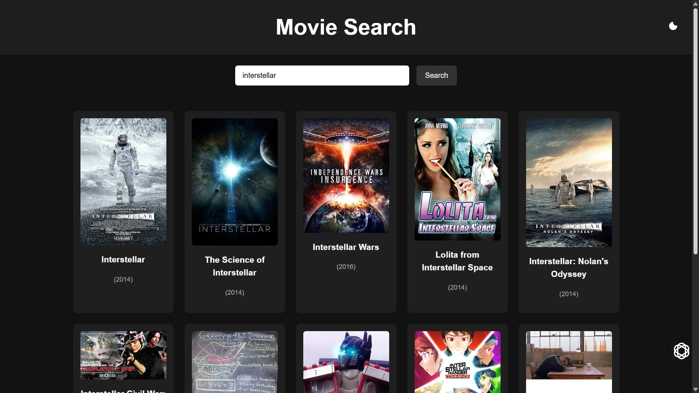
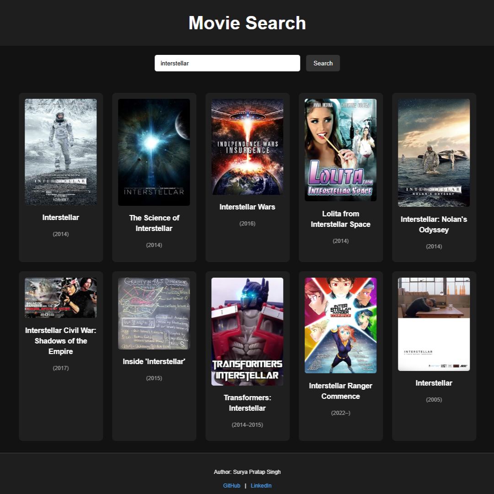

# 🎬 Movie Search Website

A clean, responsive, and modern movie search web application built using **HTML**, **CSS**, and **JavaScript**. This app allows users to search for movies using the [OMDb API](https://www.omdbapi.com/), view movie posters, titles, and release years. It also includes a built-in **light/dark mode toggle** with dynamic SVG icon switching.

---

## 🚀 Features

- 🔍 Real-time movie search powered by OMDb API  
- 🌗 Light/Dark theme toggle with animated SVG icons  
- 📱 Responsive grid layout for movie cards  
- ⚡ Fast and lightweight with smooth transitions  
- ❌ Graceful handling of no results

---

## 📸 Preview


 

---

## 🛠️ Technologies Used

- HTML5  
- CSS3 (Flexbox, Grid)  
- JavaScript (ES6)  
- [OMDb API](http://www.omdbapi.com/)

---

## 🧪 Getting Started

To run this project locally:

```bash
# Clone the repository
git clone https://github.com/your-username/movie-search-app.git

# Navigate to the project directory
cd movie-search-app

# Open index.html in your browser

---

🔑 API Key Setup
This app uses the OMDb API which requires a free API key.

Visit OMDb API and request a free API key.

Open the script.js file.
const API_KEY = 'your_api_key_here';

---

📂 Project Structure
movie-search-app/<br>
├── index.html<br>
├── style.css<br>
├── script.js<br>
└── preview.png<br>

---

🌗 Theme Toggle
🌙 Moon icon shown in dark mode

☀️ Sun icon shown in light mode

SVG icons switch dynamically when the theme is toggled
